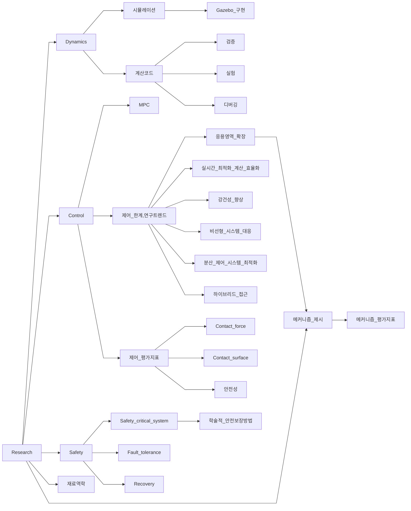

# 테스트 다이어그램




# 메모
- 중요한건 학술적 접근
- 되게 만든다는 개발적 접근 방법. 학술적 관점에서, 전세계적의로 성능을 끌어올리기 위한 관점으로의 접근 필요
- Contribution: 제어적 고도화 vs 응용영역 확장

# 플랜
- 동역학
  - 디버깅 - 상체 추가
  - 실제 데이터와 비교
  - 토크 - 전류 모델 생성
  - Gazebo
- partial modeling(?)
  - 공통
    - 기어박스
  - 어센더
    - 쉬브
    - 풀리
    - 로프
  - 휠레그
    - 타이밍벨트
    - 타이밍풀리

- Contact model
  - soft
  - hard

- issue
  - 로프각 측정
  - 로프 손상

- Safety critical system
  - 제어 장벽 함수 (Control Barrier Function)
- mechanical failure

MPC 
- 

- 실험


- 1108
  - 연구 내용 정리
  - 연구노트 정리
  - 윈도우 & 우분투 세팅 정리
  - 코드 저장소 구성
  - 저장소 정리


# MPC 분야의 성능 향상을 위한 최신 연구 접근방법
- 실시간 최적화 계산 효율화
  - Explicit MPC: 오프라인에서 최적 제어 법칙을 미리 계산
  - Fast MPC: 고속 QP 솔버 알고리즘 개발
  - Warm starting: 이전 해를 초기값으로 활용
  - Move blocking: 제어 입력의 자유도를 줄여 연산량 감소

- 강건성 향상
  - Robust MPC: 모델 불확실성과 외란을 고려한 설계
  - Adaptive MPC: 실시간 모델 파라미터 추정 및 제어기 조정
  - Stochastic MPC: 확률적 불확실성을 고려한 접근
  - Learning-based MPC: 데이터 기반 모델 개선

- 비선형 시스템 대응
  - Economic MPC: 비선형 비용함수 직접 최적화
  - Real-time iteration scheme: 비선형 최적화 문제의 실시간 근사해법
  - Multiple shooting methods: 긴 예측 구간의 효율적 처리

- 분산 제어 시스템 최적화
  - Distributed MPC: 부분 시스템 간 협조 제어
  - Hierarchical MPC: 다층 구조의 제어 체계
  - Decentralized MPC: 독립적 부분 시스템 제어

- 하이브리드 접근
  - MPC + 강화학습 결합
  - MPC + 신경망 제어기 통합
  - MPC + 적응제어 하이브리드

# MPC 4족 로봇 제어 평가 지표 및 안정성 분석

## 제어 성능 평가 지표

### 기본 성능 지표

- 제어 입력
  - 제어 입력의 크기 (magnitude)
  - 불필요한 제어 입력 최소화
  - 제어 입력의 변화율 (rate)
  - 에너지 소비량

- **정착시간 (Settling Time)**
  - 목표값의 일정 범위(±2% 또는 ±5%) 내 도달 시간
  - 시스템의 응답 속도 평가

- **오버슈트 (Overshoot)**
  - 목표값 초과 최대 편차의 백분율
  - 과도 응답 특성 평가
  - 일반적으로 10% 미만이 바람직

- 언더슈트

- **정상상태 오차 (Steady-state Error)**
  - 안정화 후 목표값과의 영구적 오차
  - 제어 정확도 평가

- **Rise Time**
  - 최종값의 10%에서 90%까지 도달 시간
  - 초기 응답 특성 평가

### 보행 및 운동 성능
- **보행 품질**
  - 보행 속도와 안정성
  - 보폭 조절 능력
  - 보행 패턴 전환 안정성 (걷기-뛰기, 방향 전환)
  - 에너지 효율적 보행
  - 다양한 지형 적응력

- **다리 제어 성능**
  - 다리 간 협조 성능
  - 지면 접촉력 분배 정확도
  - 발끝(foot placement) 정확도
  - 임피던스 제어 성능
  - 접지력(Ground Reaction Force) 제어

- **전신 운동 제어**
  - 무게중심(CoM) 제어 정확도
  - 각운동량 제어 성능
  - 자세 복원력
  - 동적 안정성 마진
  - 급정지/급발진 안정성

### 동작 품질
- 부드러운 동작 생성 
  - 급격한 가속/감속 회피
  - 급격한 제어 입력 변화 최소화
  - 자연스러운 궤적 생성
- 정밀한 위치/힘 제어
  - 발끝 위치 정확도
  - 접촉력 정밀 제어
- 실시간 동적 대응
  - 장애물 회피 능력
  - 환경 변화 즉각 대응
  - 외란/충격 흡수 및 보상

### 추종 오차 (Tracking error)
- 시간에 따른 기준 궤적과 실제 궤적의 차이
- RMS (Root Mean Square) 오차로 정량화
- 발끝 궤적 추종 정확도
- 무게중심 궤적 추종 정확도

### 지형 적응성
- 지면 상태 추정 정확도
- 불규칙 지형 극복 능력
- 장애물 회피/극복 성능
- 경사면 안정성
- 미끄러짐 대응 능력

### 최적화 관련 지표
- **비용함수 값 (Cost Function Value)**
  - 추적 오차와 제어 입력의 가중합
  - 전체 제어 성능 평가

- **계산 시간 (Computation Time)**
  - 제어 주기당 최적화 소요 시간
  - 평균/최대 계산 시간
  - 실시간 구현 가능성 평가
  - 고속 샘플링 (1kHz 이상)
  - 다자유도 실시간 제어

- **수렴성 (Convergence)**
  - 최적화 알고리즘의 반복 횟수, 속도, 정확도
  - QP 해의 존재성/유일성
  - 실시간 계산 보장
  - 해법의 효율성 평가

### 강건성 지표
- **제어 안정성 여유**
  - 시스템의 안정성 정도
  - 불확실성 대응 능력
  - 게인 마진, 위상 마진 확인

- **모델 불확실성 민감도**
  - 모델 오차에 대한 반응
  - 외란 관측기의 성능 평가
  - 강건 제어 성능 평가

- **외란 대응력**
  - 외부 밀기에 대한 대응
  - 미끄러짐 대응
  - 페이로드 변화 대응
  - 다리 고장 시 비상 대응
  - 시스템 강건성 평가

### 제약조건 관련 지표

- 다중 제약조건
  - 관절 한계 (위치, 속도, 토크)
  - 자기충돌/환경충돌 회피
  - 작업공간 제약
  - 에너지 효율 최적화
  - 접지력 제약

- **제약조건 위반 빈도**
  - 안전 경계 이탈 횟수
  - 상태 제약 위반 빈도/크기
  - 입력 제약 위반 빈도/크기
  - 마찰원추 제약 위반
  - 운영 안전성 평가

- **제약조건 만족도**
  - 제약 충족 정도
  - 운영 효율성 평가
  - 안전영역 준수 확인

- **실행가능성 여유**
  - 제약 만족 여유 정도
  - 운영 안정성 평가

## 안정성 분석
### 보행 안정성 
- **정적 안정성**
  - Support polygon 내 CoM 유지
  - 준정적 보행 안정성
  
- **동적 안정성**
  - Zero Moment Point (ZMP) 제약조건
  - Centroidal momentum 제어
  - 동적 보행 안정성 마진
  - Angular momentum 제어

### 접촉 안정성
- **접촉력 제어**
  - 마찰원추 제약조건
  - 접촉력 분배 최적화
  - 슬립 방지 제어

- **접촉 전환**
  - 스윙-스탠스 전환 안정성
  - 다중 접촉 제어
  - 접촉 상태 추정

### 이론적 안정성
- **리아프노프 안정성 (Lyapunov Stability)**
  - 리아프노프 함수 기반 검증
  - 점근적 안정성 분석
  - 종말 집합 안정성

- **입력-상태 안정성 (ISS)**
  - 입력 대비 상태 유계성
  - 외란 강인성 분석
  - ISS 리아프노프 함수 검증

### 구현 관련 안정성
- **Recursive Feasibility**
  - 연속적 실행가능성 보장
  - 제약조건 만족 연속성
  - MPC 핵심 안정성 요구사항

- **Persistent Excitation**
  - 시스템 식별 안정성
  - 파라미터 추정 수렴성
  - 적응 제어 안정성

### 불변성 및 강인성
- **Nominal & Robust Positive Invariance**
  - 공칭/강인 양의 불변성
  - 상태 구속 보장
  - 안전 전략 수립

- **Uniform Stability**
  - 시변 시스템 안정성
  - 일관된 성능 보장
  - 초기조건 민감도

- 모델링 오차에 대한 강인성
  - 실제 시스템과 모델 간 차이에 대한 대응력
  - 지면 접촉 모델링 오차 대응
  - 다리 동역학 불확실성 처리

### 물리적 시스템 안정성
- **Passivity**
  - 에너지 기반 안정성
  - 지면 접촉 에너지 관리
  - 충격 흡수 성능

- **Region of Attraction**
  - 초기조건 동작 범위
  - 안정 영역 계산
  - 운영 범위 결정

### 실용적 안정성
- **수치적 안정성**
  - 최적화 알고리즘 안정성
  - 부동소수점 정밀도
  - 불연속성/특이점 처리
  - 실시간 신뢰성

- **Multi-rate Effects**
  - 다중 샘플링 영향
  - 지연시간 고려
  - 센서-제어 동기화

### 제약조건 및 복구
- **Constraint Handling**
  - Hard/Soft 제약 처리
  - 제약 완화 영향
  - 위반 복구 전략

- **Feasibility Recovery**
  - 실행불가능 복구
  - 백업 제어 전환
  - 비상 정지 처리
  - 다리 고장 대응

### 계층적 안정성
- **Hierarchical Control**
  - 계층간 안정성 연계
  - 다중 계층 MPC
  - 전신/다리 제어 통합

## 구현 시 고려사항

### 실제 적용 주의점
- 이론과 구현의 차이 검토
- 계산 지연 영향 분석
- 샘플링 시간 설정
- 모델 불확실성 고려
- 실시간 구현 가능성
- 센서 노이즈 처리
- 지면 접촉 추정 정확도

### 경제적 평가
- 하드웨어 요구사항
  - 필요한 센서, 컴퓨터 사양
- 메모리 사용량
  - 하드웨어 리소스 제약 만족 여부
- 에너지 소비량
  - 보행 시 에너지 효율성
  - 배터리 사용 시간
- 작업 수행 시간
  - 이동 속도와 효율성
- 유지보수 비용
  - 시스템 운영 및 관리 비용
  
### 종합적 평가
- 응용 분야별 중요도 조정
- 다중 지표 통합 평가
- 안전성 중심 설계
  - 충돌 회피 성능
  - 비상 정지 기능
- 성능과 안정성 균형
- 확장성: 다른 보행 패턴으로의 적용 가능성


# MPC 4족 로봇 제어 평가 지표 및 안정성 분석

## 제어 성능 평가 지표

### 기본 성능 지표

- **제어 주기 및 계산 성능**
  - 제어 주파수: 250-500Hz
  - MPC 최적화 계산 시간: 1-5ms
  - 전체 제어 루프 지연: < 10ms
  - QP 솔버 반복 횟수: < 20회
  - 센서-액추에이터 지연: < 10ms

- **상태 추정 성능**
  - 자세 추정 지연: < 5ms
  - 지면 접촉 감지 지연: < 20ms
  - 상태 추정 갱신 주기: > 400Hz

### 보행 성능 지표

- **속도 제어**
  - 정상상태 속도 오차: < 0.05m/s
  - 속도 명령 지연시간: < 0.3s
  - 최대 보행 속도: 1.2-3.7m/s (로봇 크기별 상이)
  - 방향 전환 각속도: < 1.0rad/s

- **자세 안정성**
  - Base height 추종 오차: RMS < 2cm
  - Roll/Pitch 자세 오차: RMS < 0.1rad
  - Yaw 추종 오차: < 0.2rad
  - CoM 높이 변동: < ±3cm

- **보행 전환**
  - 보행 패턴 전환 시간: < 0.8s
  - 전환 중 높이 변화: < 4cm
  - 전환 중 pitch 변화: < 0.25rad

### 지면 접촉 제어

- **접촉력 제어**
  - 수직항력 예측 오차: < 20%
  - Ground reaction force 예측 오차: < 15%
  - 마찰력 제약 위반: < 1%
  - 접촉력 방향 오차: < 15도

- **발끝 제어**
  - 발끝 위치 오차: < 2cm
  - Swing 궤적 추종 오차: RMS < 1.5cm
  - 착지 위치 오차: < 2cm

### 강건성 지표

- **외란 대응**
  - 최대 수평 충격 흡수: 80-100N
  - 연속 측면 외란: 50N
  - 충격량 극복: 100N·s

- **지형 적응**
  - 최대 등반 경사: 20-30도
  - 불규칙 지형 높이: ±10cm
  - 연속 계단: 15cm 높이
  - 최대 극복 장애물: 15cm

- **모델 불확실성 허용**
  - 질량/관성 변화: ±20%
  - 마찰계수 변화: ±50%
  - 페이로드: 자체 무게의 25%까지
  - 지면 높이 불확실성: ±5cm

### 에너지 효율성

- **동력 소비**
  - 기계적 동력: < 200W (평지 보행)
  - Cost of Transport: 0.2-0.5
  - 평균 전력 소비: 23W (정지 시)
  - Peak 전력: 170W (동적 움직임)

### 최적화 관련 지표

- **실시간성**
  - MPC 계산 시간: 1-2ms
  - 제어 주기 편차: < 0.1ms
  - 실시간 구현 성공률: > 99%

- **수렴성**
  - 최적화 반복 횟수: < 20회
  - Cost 감소율: 90% (첫 10회 반복 내)
  - Constraint violation: < 1e-3

### 모멘텀 제어

- **Linear momentum**
  - 추종 오차: < 5%
  - 속도 명령 추종: < 0.1m/s
  - 가속도 제한: < 3m/s²

- **Angular momentum**
  - 추종 오차: < 10%
  - 자세 안정화: < 0.15rad
  - 각속도 제한: < 1rad/s

### 안전성 지표

- **물리적 제약**
  - 관절 토크 제한: < 80% 정격
  - 관절 속도 제한: < 90% 최대
  - 관절 각도 제한: > 5° 여유

- **작업 공간**
  - Support polygon 이탈: < 1cm
  - Swing foot 높이: > 5cm
  - Base 기울기: < 30°

### 적응성 지표

- **모델 적응**
  - 질량/관성 추정 시간: < 5s
  - 마찰계수 추정 오차: < 30%
  - 지면 강성 추정: 500-10000N/m

- **지형 적응**
  - 지면 상태 추정 시간: < 0.1s
  - 마찰계수 추정범위: 0.2-0.8
  - 지면 강성 적응범위: > 10배

### 실용성 지표

- **연속 운용**
  - 배터리 지속시간: 2-4시간
  - 실패 복구 시간: < 2s
  - 자가 복구 성공률: > 90%

- **환경 대응**
  - 동작 온도: 0-40℃
  - 방수/방진: IP54
  - 습도: 20-80%

## 평가 시 고려사항

1. 모든 지표는 최소 5회 이상의 반복 실험 평균값 사용
2. 외란 테스트는 로봇 크기/무게에 따라 스케일링 필요
3. 계산 시간은 사용 하드웨어 스펙 명시 필요
4. 에너지 효율성은 동일 조건(속도, 지형)에서 비교
5. 안정성 마진은 최악의 경우(worst-case) 기준 평가


# Safety Critical System의 안전 보장 요소

## 1. Safety Integrity Level (SIL)
- IEC 61508 표준에서 정의된 안전 무결성 수준
- SIL 1부터 SIL 4까지의 등급으로 분류
- 각 등급별 요구되는 Risk Reduction Factor (RRF) 정의
- 시스템의 위험도에 따른 적절한 SIL 레벨 선정 필요

## 2. Formal Methods
- DO-178C (항공), IEC 62279 (철도) 등의 표준에서 권장
- 수학적 증명을 통한 시스템 정확성 검증
- Model Checking
- Theorem Proving
- Abstract Interpretation

## 3. Fault Tolerance Techniques
- IEC 61508에서 제시하는 주요 방법론:
  - Triple Modular Redundancy (TMR)
  - N-Version Programming
  - Recovery Blocks
  - Backward Recovery
  - Diversity Implementation

## 4. Safety Analysis Techniques
- FMEA (Failure Mode and Effects Analysis)
- FTA (Fault Tree Analysis)
- HAZOP (Hazard and Operability Study)
- STAMP (Systems-Theoretic Accident Model and Processes)
- STPA (System-Theoretic Process Analysis)

## 5. Certification Standards
- 도메인별 필수 인증:
  - 항공: DO-178C/DO-254
  - 철도: EN 50128/50126/50129
  - 자동차: ISO 26262
  - 의료기기: IEC 62304
  - 산업: IEC 61508/61511

## 6. Verification & Validation
- IEC 61508과 도메인별 표준에서 요구하는:
  - Requirements Traceability
  - Static Analysis
  - Dynamic Testing
  - Code Coverage Analysis
  - Independent Verification

## 7. Safety Life Cycle
- IEC 61508에서 정의하는 전체 수명주기 관리
- Hazard Analysis
- Safety Requirements Specification
- Safety Validation Planning
- Safety Assessment
- Safety Verification


# 안전성 중심 MPC 수식 구성

## 기본 최적화 문제

안전성 중심 MPC는 기존 MPC에 안전 제약조건과 비용을 추가한 최적화 문제로 구성됩니다.

### 목적 함수
```
min J = Σ(k=0 to N-1) [||x(k) - xref(k)||²Q + ||u(k)||²R] + ||x(N) - xref(N)||²P
```
여기서:
- x(k)는 시스템 상태
- u(k)는 제어 입력
- xref(k)는 목표 궤적
- Q, R, P는 가중치 행렬

## 제약 조건

### 1. 시스템 동역학 제약
```
x(k+1) = Ax(k) + Bu(k)
```
- A: 시스템 상태 행렬
- B: 입력 행렬

### 2. 기본 제약조건
```
xmin ≤ x(k) ≤ xmax   (상태 제약)
umin ≤ u(k) ≤ umax   (입력 제약)
```

### 3. 안전 관련 제약조건

#### a) 제어 장벽 함수 (Control Barrier Function)
```
h(x) ≥ 0
ḣ(x) + αh(x) ≥ 0   (α > 0)
```
- h(x)는 안전 영역을 정의하는 장벽 함수
- α는 안전 여유 매개변수

#### b) 안전 거리 제약
```
||x(k) - xobstacle|| ≥ dsafe
```
- dsafe는 최소 안전 거리
- xobstacle는 장애물 위치

#### c) 제어 변화율 제약
```
||u(k+1) - u(k)|| ≤ Δumax
```
- Δumax는 최대 허용 제어 변화율

### 4. 비상 정지 조건
```
||v(k)|| ≤ vmax    (속도 제한)
||a(k)|| ≤ amax    (가속도 제한)
```

### 5. 안정성 제약
```
V(x(k+1)) - V(x(k)) ≤ -γV(x(k))   (γ > 0)
```
- V(x)는 리아프노프 함수
- γ는 수렴 속도 매개변수

## 추가 안전 비용 항목

안전 관련 추가 비용 함수:
```
J_safety = w1 * Σ(1/h(x(k))) + w2 * Σ||u(k+1) - u(k)||² + w3 * Σ||v(k)||²
```
여기서:
- w1: 안전 영역 가중치
- w2: 제어 부드러움 가중치
- w3: 속도 제한 가중치

최종 비용 함수:
```
J_total = J + J_safety
```

## 주요 이점

1. 장벽 함수를 통한 안전 영역 보장
2. 급격한 제어 입력 변화 방지
3. 속도/가속도 제한을 통한 안전성 확보
4. 리아프노프 안정성 보장

## 구현 방법

이 최적화 문제는 다음과 같은 방법으로 해결할 수 있습니다:
- QP (이차 계획법)
- SQP (순차적 이차 계획법) 최적화 도구 사용

## 실제 적용시 고려사항

1. 계산 복잡도
   - 실시간 구현을 위한 최적화 필요
   - 예측 구간(N) 선택 시 계산 부하 고려

2. 안전 매개변수 조정
   - α, dsafe, Δumax 등의 적절한 설정 필요
   - 시스템 특성에 맞는 가중치 (w1, w2, w3) 선정

3. 장애물 회피
   - 동적 장애물 고려 필요
   - 실시간 장애물 감지 및 대응 전략 수립